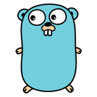
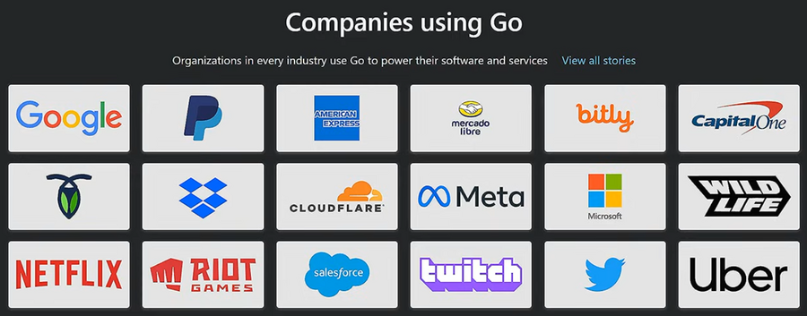

# GoLang Notes
A collection of notes i've made while learning GoLang

---

### Why Learn GoLang?
1. All the cool kids are using Go these days.
2. Its really Efficient, and gives you low level control without the complexity of C++
3. Runs faster than Java, compiles faster than c++, and its easier to deploy than Python.
4. Npm, PyPI, and Crates.io are currently suffering from alot of scary supply chain attacks, while the Go ecosystem is intentionally decentralized. 
5. Docker and Kubernetes were written in Go.
6. Go is one of the top languages for distributed cloud infrastructure, and many companies rely on Go

### About GoLang
GoLang is a statically typed, compiled, programming language, designed by Google

##### History
- It was created in 2007 by [Robert Griesemer](https://en.wikipedia.org/wiki/Robert_Griesemer), [Rob Pike](https://en.wikipedia.org/wiki/Rob_Pike), and [Ken Thompson](https://en.wikipedia.org/wiki/Ken_Thompson) at Google as a solution to improve programming productivity
- It was publically announced in 2009 as an open-source project.
- in 2012 the first stable version was released, Go v1.0

